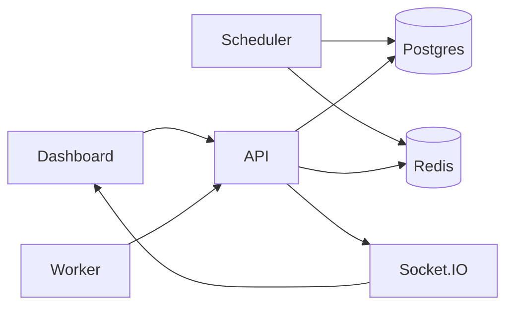

# Architecture

> **Athul S** · Registration No. **RA2311047010117**


## Layout


Three processes + shared packages:

- **backend** — REST API, Socket.IO for dashboard updates
- **scheduler** — separate process (`backend/src/scheduler.ts`) promotes `scheduled_jobs`, retries, stale workers
- **worker** — registers with a secret, polls for jobs, runs handlers, reports back
- **frontend** — React dashboard with org/project picker, all job types, RBAC-aware UI

Postgres holds everything. Redis is for rate limiting, per-job locks, and scheduler leader election. If Redis is unavailable, locks/rate limits fall back to an in-memory store (single-instance dev only).



## API server

Handles auth (JWT), orgs/projects/queues with RBAC, creating all job types, worker registration, the claim/complete/fail flow, metrics, and system events.

## Scheduler process

Runs separately from the API by default (`npm run dev:scheduler -w backend`). Every 5s it:

- acquires a Redis leader lock (skips tick if another instance holds it)
- reads due rows from `scheduled_jobs` and promotes jobs to `QUEUED`
- moves `FAILED` jobs back to `QUEUED` when retry delay elapsed
- spawns immediate job instances for recurring cron templates

- marks workers offline if heartbeat is stale

- releases claims that sat too long without starting


Without Redis, every API instance runs the scheduler (fine for single-node dev).


## Workers


On startup: register with `X-Worker-Registration-Key` → receive worker ID + secret → poll loop → claim up to N jobs → execute → heartbeat every 5s.


All worker endpoints require `X-Worker-Id` + `X-Worker-Secret`. Secrets are bcrypt-hashed in the DB.


Handlers are functions keyed by name (`echo`, `sleep`, `fail`, etc.). Adding a new one means dropping a function in `worker/src/handlers.ts`.


Optional `shardKey` on worker + queue routes jobs to matching shards only.


Graceful shutdown: set status to DRAINING, wait for in-flight jobs (30s max), exit.


## Job states


```

QUEUED → CLAIMED → RUNNING → COMPLETED

                    ↓

                  FAILED → (retry) → QUEUED

                    ↓

               DEAD_LETTER

```


Scheduled jobs sit in `SCHEDULED` until the scheduler promotes them. Jobs with unresolved dependencies stay blocked until prerequisites complete.


## Claiming jobs (the important bit)


This is the query that prevents double-execution:


```sql

SELECT j.id, j.queue_id FROM jobs j

JOIN queues q ON q.id = j.queue_id

WHERE j.status = 'QUEUED' AND q.status = 'ACTIVE'

ORDER BY j.priority DESC, j.created_at ASC

LIMIT 10

FOR UPDATE OF j SKIP LOCKED

```


Then per candidate we check queue concurrency limit, optional rate limit (Redis), shard key match, and whether dependency jobs finished.


Prisma doesn't support `SKIP LOCKED` in its query builder so this one lives as raw SQL in `worker.service.ts`.


## RBAC


Org roles: OWNER > ADMIN > MEMBER > VIEWER. Checked in service layer via `getQueueWithRole` / `getJobWithRole` before mutations. VIEWER can read dashboards; MEMBER+ can create/retry/cancel jobs; ADMIN+ can manage queues and invite members.


## Event stream


`SystemEvent` table + Socket.IO broadcasts. Job lifecycle, worker registration, and scheduler ticks are persisted for the dashboard event feed.


## Typical flow


1. `POST /api/jobs/immediate` creates a row with status `QUEUED`

2. Worker calls `POST /api/workers/:id/claim`

3. API sets status `CLAIMED`, creates execution record

4. Worker calls `.../start` → `RUNNING`, runs handler

5. `.../complete` or `.../fail` → API handles retry logic or DLQ with failure summary

6. Socket event fires, dashboard refreshes


## Auth


Users get JWT. Workers identify with ID + secret (registered on startup). Registration requires `WORKER_REGISTRATION_KEY` env var.

